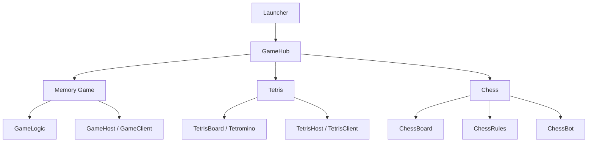
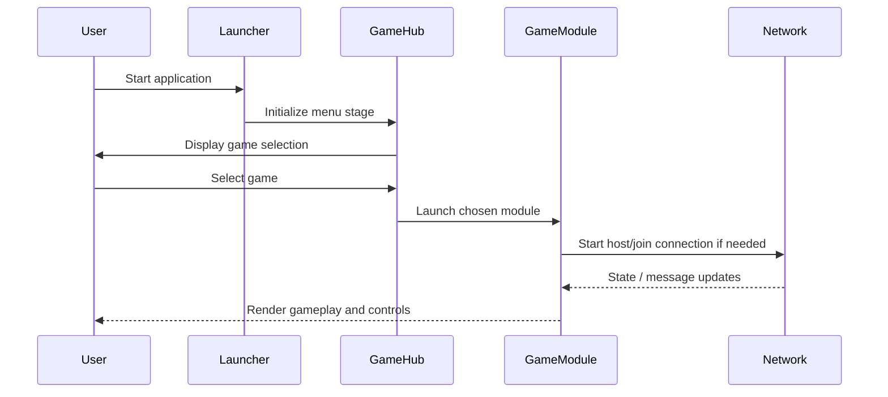
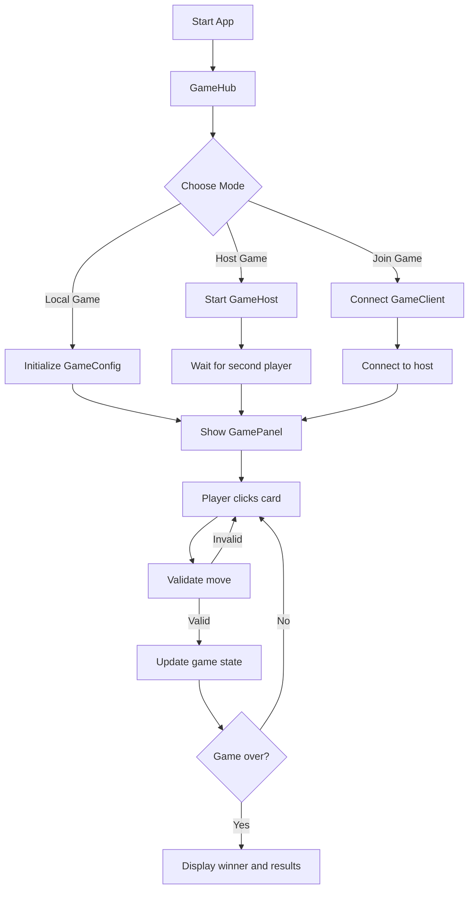
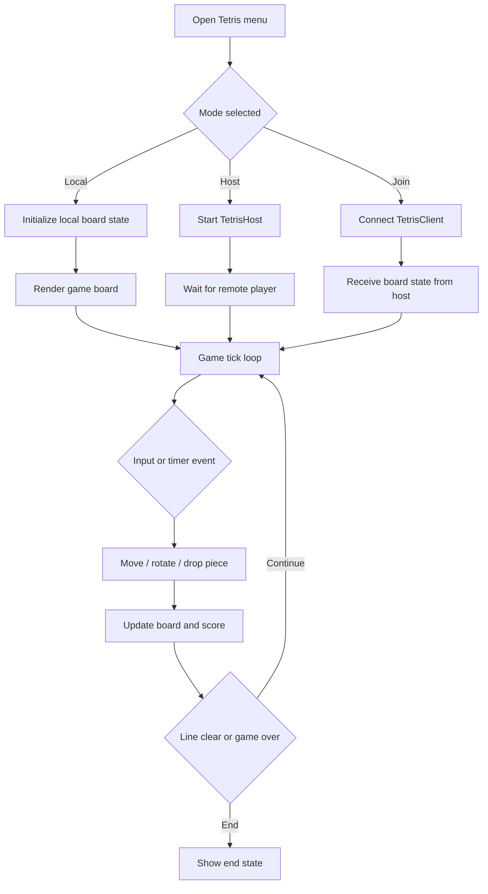
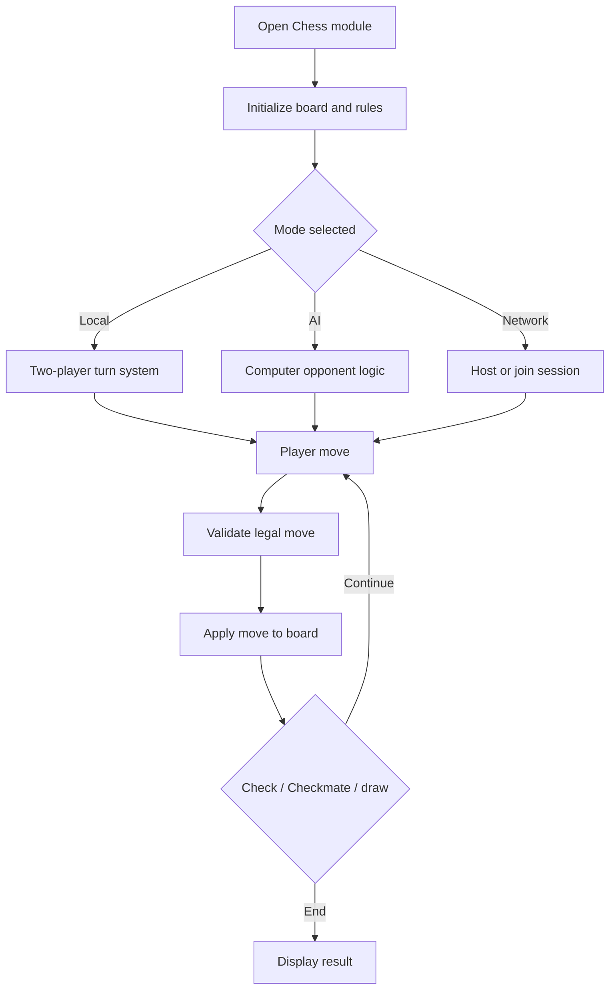

# Retro Games Compilation

A JavaFX-based arcade collection featuring a Memory Match game, a multiplayer Tetris mode, and a hexagonal chess experience. The project is designed as a single desktop application with a central hub that lets players switch between games, host LAN sessions, or join an existing match.

## Overview

This repository brings together three game experiences in one application:

- Memory Game: card-matching gameplay with local or LAN multiplayer support
- Tetris: competitive block puzzle mode with host/join capabilities
- Chess: hexagonal board gameplay with local, AI, and networked modes

The app is organized around a shared JavaFX entry flow and separate game-specific packages, keeping the gameplay logic modular while preserving a unified user experience.

---

## Project Architecture

The project follows a layered structure:

- `game_project.gamebox`: central menu system, launcher, memory game coordination, and shared game flow
- `game_project.tetris`: Tetris UI, networking, board logic, and customization tools
- `game_project.chess`: hexagonal chess rules, board logic, bots, and game state management
- `src/main/resources`: JavaFX assets, FXML resources, and image assets
- `src/test/java`: JUnit tests for game logic and validation

### High-Level Module View



### Runtime Flow



---

## Feature Breakdown

### 1. Memory Game
The Memory Game is the main menu-driven experience and acts as the core showcase for the project.

Key features:
- card-matching gameplay with configurable match size and deck size
- local two-player play on one machine
- LAN host/client networking
- status tracking for turns, scores, and win/loss states
- reusable game state and message flow between UI and logic

### 2. Tetris
The Tetris module is a standalone game flow with menu selection, local play, and multiplayer networking.

Key features:
- dual-board competitive game mode
- advanced local options like multi-block control and horizontal play
- custom piece designer for tuning game behavior
- speed adjustments and board interactions
- host/join support for LAN sessions

### 3. Chess
The chess module implements a hexagonal variant with rules and AI logic.

Key features:
- board representations and movement rules for hexagonal chess
- multiple game modes
- AI opponent support
- game state tracking and game rules enforcement

---

## Game Flow Diagrams

### Memory Game Flow



### Tetris Flow



### Chess Flow



---

## Directory Structure

```text
retro-games-compilation/
├── .github/
├── docs/
├── src/
│   ├── main/
│   │   ├── java/
│   │   │   ├── game_project/
│   │   │   │   ├── chess/
│   │   │   │   ├── gamebox/
│   │   │   │   └── tetris/
│   │   │   └── module-info.java
│   │   └── resources/
│   │       ├── images/
│   │       └── MyView.fxml
│   └── test/
│       └── java/
│           └── game_project/
├── .gitignore
├── LICENSE
├── README.md
├── custom_pieces.txt
├── pom.xml
└── target/
```

---

## Tech Stack

- Java 25
- JavaFX for desktop GUI
- Maven for project build and dependency management
- JUnit 5 for automated tests
- LAN networking for multiplayer support

---

## Getting Started

### Prerequisites

- Java 21 or newer
- Maven 3.8+
- A local machine or network environment for multiplayer testing

### Install and Run

```bash
mvn clean compile
mvn javafx:run
```

If you want to build the JAR directly:

```bash
mvn clean package
java --module-path target/classes --add-modules game_project -jar target/retro-games-compilation-1.0.0.jar
```

---

## Notes on the Design

The project is intentionally structured around a single desktop application shell with different game modules plugged into a common menu framework. This reduces duplication and allows each game to maintain its own logic while sharing a consistent UI approach, resource handling, and game-state model.

The networking design is modular too: each game can choose whether to run locally, host a session, or join an existing session without heavily coupling the gameplay logic to the transport layer.

---

## Contribution

Contributions are welcome. If you plan to extend the project, keep the following in mind:

- preserve the game hub flow and module separation
- keep network messages and state transitions consistent
- test game logic changes using the existing JUnit suite
- maintain JavaFX compatibility when adding UI elements

---

## License

This project is distributed under the repository license included in the project root.
